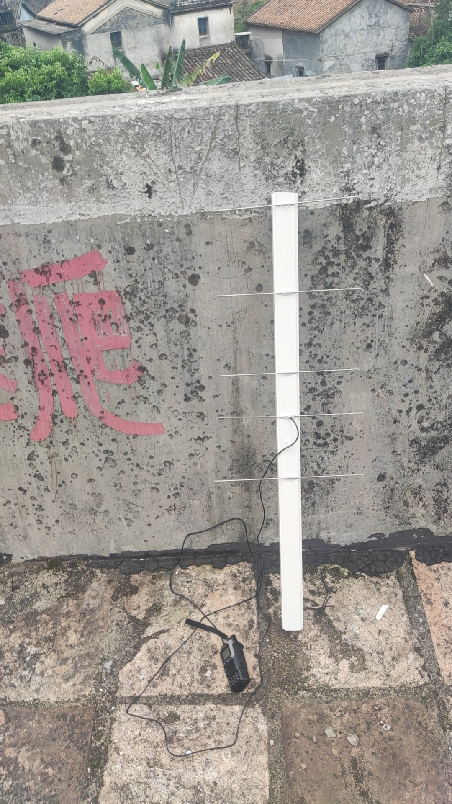
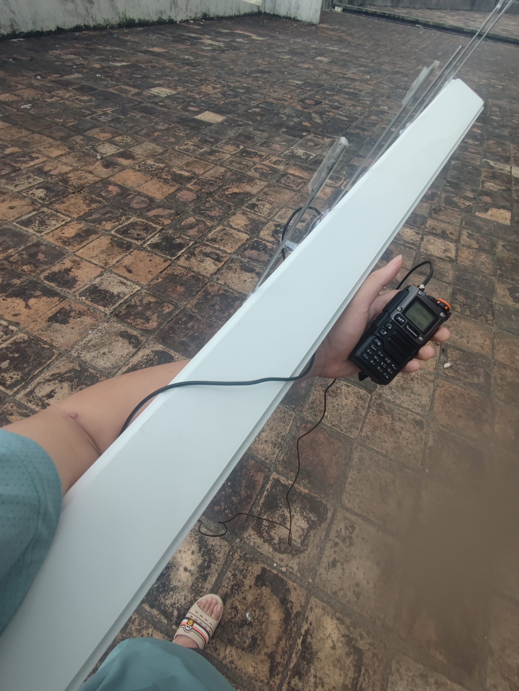
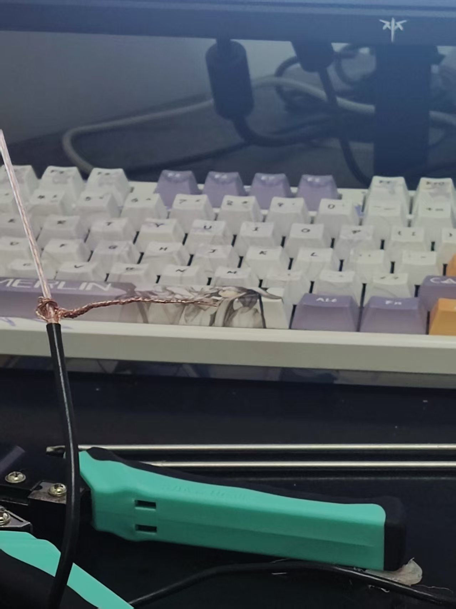
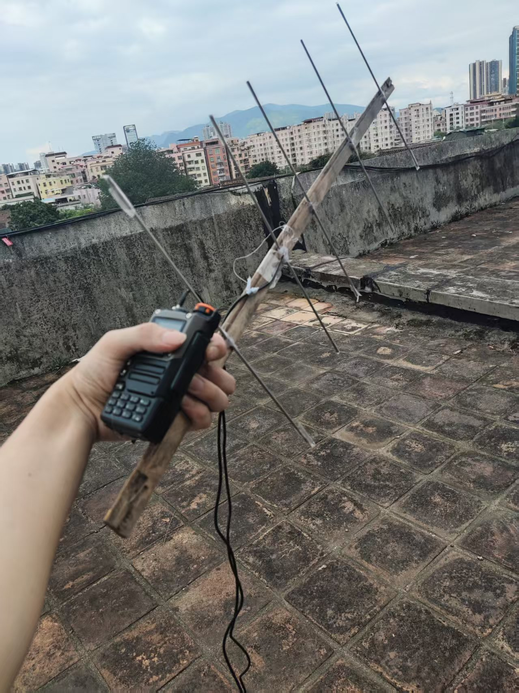
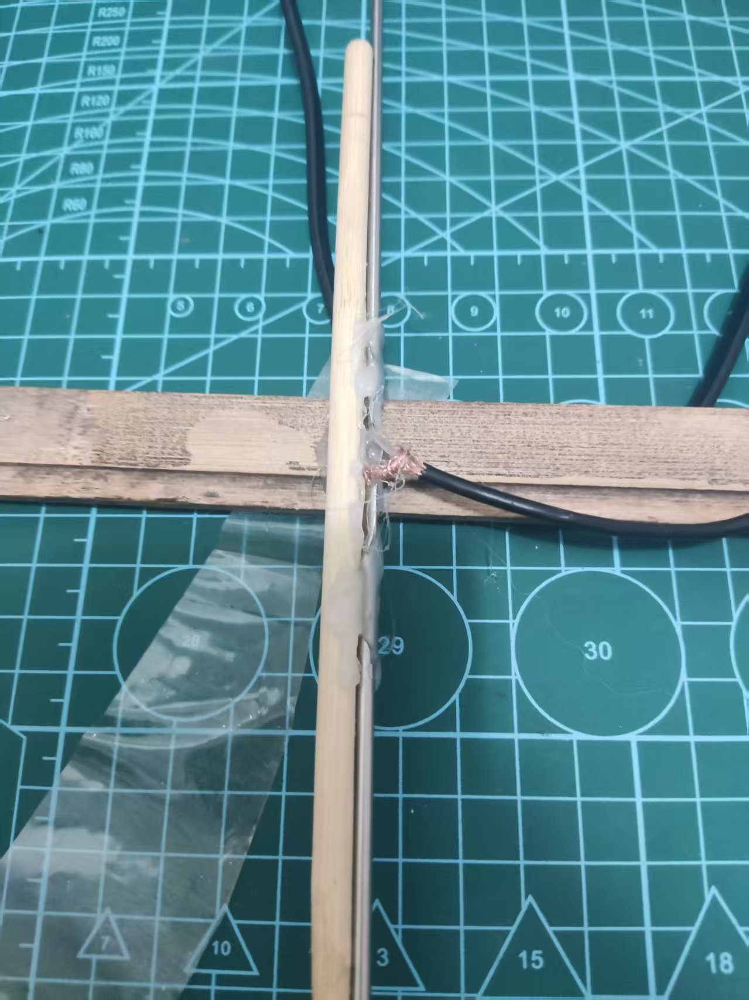
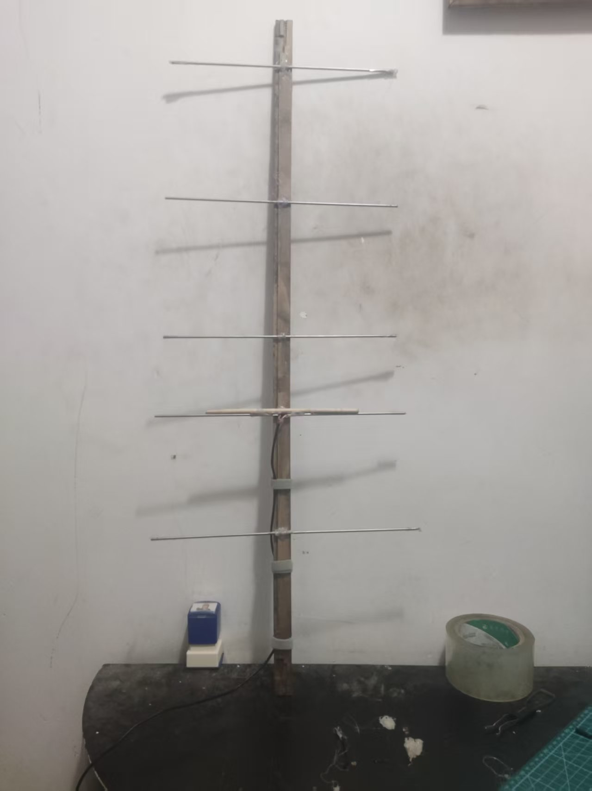

## 参考资料

以`BG8AMG`制图的五单元U段八木为基板设计

| 振子         | 长度  | 振子间隔 |
| ------------ | ----- | -------- |
| 一号引向振子 | 282mm | NONE     |
| 二号引向振子 | 298mm | 172mm    |
| 三号引向振子 | 298mm | 1712mm   |
| 有源振子     | 322mm | 99mm     |
| 反射振子     | 335mm | 146mm    |

## 微操日志

适用频段：410MHz-460MHz（430MHz-440MHz）

天线驻波：1.2

工作电压：≈10瓦

线材阻抗：50Ω

线材材质：1mm铝线

振子材质：Φ3×0.15mm不锈钢

有源振子材质：Φ3×0.15mm不锈钢

馈电点连接方式：压接

主梁与振子连接方式：热熔

### 2025.5.13更新：

1、更换主梁，使其便于携带

2、增大馈电点面积

### 2025.5.14日更新：

1、加固有源振子

2、调整指向振子的倾斜角度

